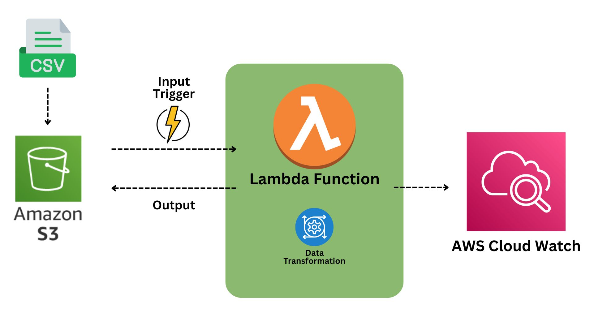

# 📦 Serverless Data Transformation Pipeline using AWS Lambda & S3

This project demonstrates a simple yet powerful serverless data pipeline built using AWS services. The pipeline is triggered when a CSV file is uploaded to an Amazon S3 bucket. AWS Lambda processes the file, performs data transformation, and logs the output to AWS CloudWatch.

## 🚀 Overview

- Upload CSV files to an S3 bucket
- Automatically trigger AWS Lambda using an S3 event
- Transform the data inside Lambda using Python
- Store output back to S3 or log details to AWS CloudWatch for monitoring and debugging

## 🛠️ Technologies Used

- **Amazon S3** – for storage of incoming CSV files and transformed output
- **AWS Lambda** – serverless function to process and transform data
- **AWS CloudWatch** – for logging and monitoring the Lambda function
- **Python 3.9** – used for data transformation inside the Lambda function

## 📁 Project Structure

