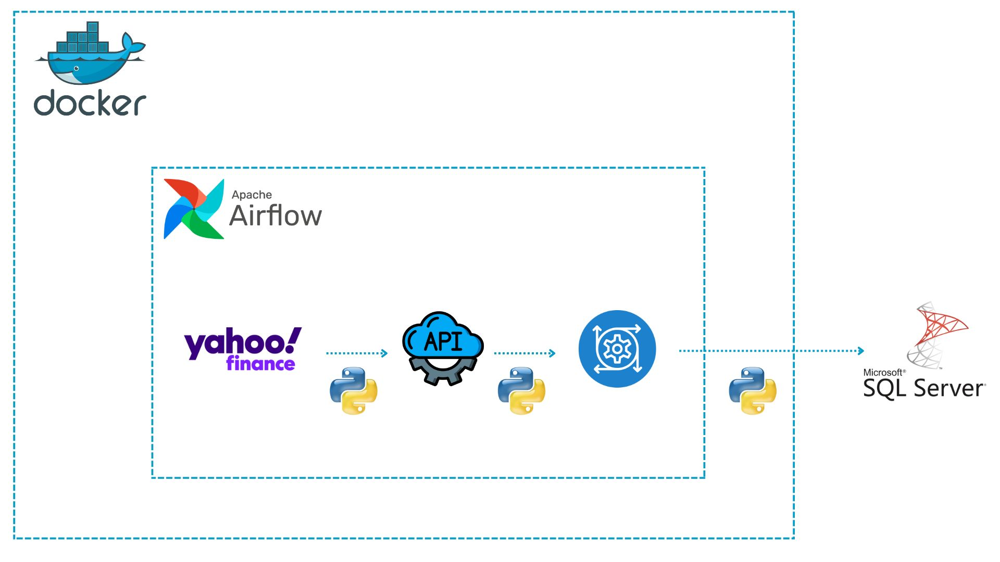

# Yahoo Finance ETL Pipeline Using Airflow, Docker, and SQL Server



## 📌 Project Overview

This project automates the extraction, transformation, and loading (ETL) of financial market data from **Yahoo Finance API** into a **Microsoft SQL Server** database. The pipeline is managed using **Apache Airflow** and fully containerized with **Docker**.

---

## ⚙️ Workflow

1. **Data Extraction**  
   Python scripts fetch market data from **Yahoo Finance** using an API call.

2. **Data Transformation**  
   The data is cleaned, normalized, and transformed into a structured format.

3. **Data Loading**  
   The transformed data is loaded into a **Microsoft SQL Server** database using Python.

4. **Orchestration with Apache Airflow**  
   Airflow is used to define and automate the ETL DAG.

5. **Containerization with Docker**  
   All services run in isolated containers for better environment control and reproducibility.

---

## 🛠 Technologies Used

| Tool | Purpose |
|------|---------|
|  | Data Fetching & Processing |
|  | Task Scheduling & Orchestration |
|  | Financial Data Source |
|  | Data Storage |
|  | Containerization |

---

## 🚀 How to Run the Project

### Prerequisites

- Docker and Docker Compose installed
- Microsoft SQL Server running (local or remote)

### Steps

1. **Clone the repository**
   ```bash
   git clone https://github.com/yourusername/yahoo-finance-etl.git
   cd yahoo-finance-etl
