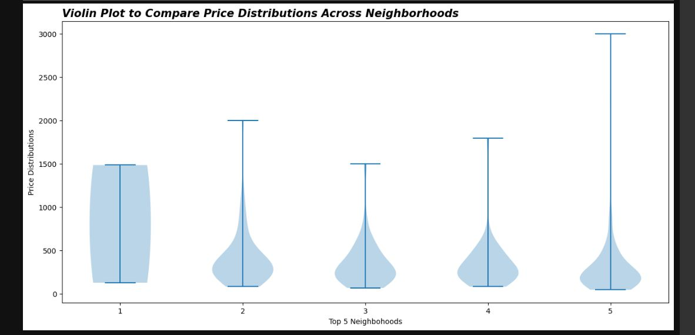

# 📊 EDA Project 1 - Analyzing Airbnb Market Trends

## 🧠 Project Objective

This project aims to explore and analyze Airbnb listings using **Exploratory Data Analysis (EDA)** techniques. We will uncover insights related to room types, neighborhood pricing, review trends, and listing descriptions through visualizations and data aggregation.

---

## 📦 Project Structure

This project is divided into three levels of analysis:

- **Basic Analysis**
- **Intermediate Analysis**
- **Advanced Analysis**

We also include rich **visualizations** and **bonus questions** using advanced Python libraries.

---

## 🛠 Technologies Used

| Tool/Library | Purpose |
|--------------|---------|
| **Pandas** | Data manipulation and aggregation |
| **Matplotlib** | Visualizations and custom plots |
| **Seaborn** | Advanced statistical visualizations |
| **Plotly / Altair** | Interactive plots (Bonus) |
| **Python (Core)** | Logic, collections, datetime |
| **Jupyter Notebook** | Project execution environment |

---

## 🔍 Analysis Breakdown

### ✅ Basic Analysis
1. **Review Dates**  
   - Find the earliest and latest review dates.
2. **Private Room Listings**  
   - Count how many listings are private rooms.
3. **Average Price**  
   - Compute the average price of listings.
4. **Summary Table**  
   - Combine the above into a single-row `DataFrame`.

---

### 📊 Intermediate Analysis
5. **Neighborhood Trends**  
   - Identify top 5 neighborhoods by average price.
6. **Description Word Frequency**  
   - Use NLP to find top 10 frequent words (excluding stopwords).

---

### 🚀 Advanced Analysis
7. **Room Type Comparison**  
   - Bar chart of average prices for each room type.
8. **Review Trends Over Time**  
   - Line graph of monthly review counts.
9. **Regression Plot (Matplotlib)**  
   - Scatter plot with regression line & annotations.
10. **Strip Plot (Seaborn)**  
   - Price vs. room type grouped by neighborhood.

---

### 🖼️ Visualization Questions
11. **Bar Chart**  
   - Count of listings per room type.
12. **Heatmap**  
   - Correlation between price and review frequency.
13. **Pie Chart**  
   - Proportion of each room type.
14. **Histogram**  
   - Price distribution with $50 bins.
15. **Violin Plot**  
   - Price distribution by neighborhood.

---

### ⭐ Bonus Section
1. **Outlier Detection**  
   - IQR method + scatter plot to highlight high-priced listings.
2. **Interactive Visualization**  
   - Use Plotly or Altair for neighborhood-price trends with tooltips.

---

## 📁 Notebook Requirements

Ensure your `.ipynb` file includes:
- ✅ Step-by-step solutions for each task
- ✅ 2–3 sentence explanations per task
- ✅ Labeled charts/graphs
- ✅ All code cells executed with visible outputs

📌 **File Naming Format**:  
`EDA_Project1_<YourName>.ipynb`

---

## 📧 Contact

**Muhammad Kabir ud Din**  
Lecturer, Noor e Hamza Islamic College  
Email: [your.email@example.com]

---

